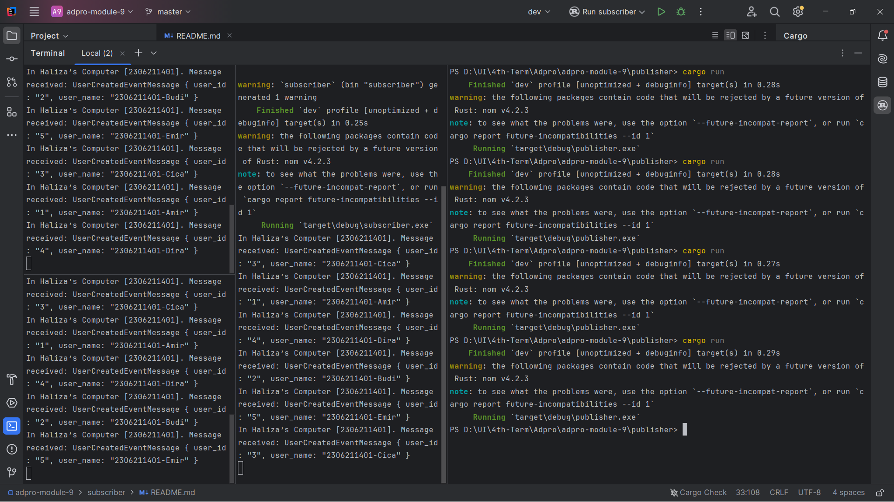

# Adpro - Tutorial 9 - Subscriber
Haliza N. S. Arfa | 2306211401 | Adpro A

---

## What is `amqp`?

AMQP atau Advanced Message Queuing Protocol adalah protokol komunikasi terbuka yang dirancang untuk mendukung pengiriman pesan antar sistem yang berbeda secara efisien dan aman.
AMQP memungkinkan aplikasi yang berbeda untuk berkomunikasi satu sama lain tanpa perlu mengetahui detail implementasi masing-masing.
AMQP sangat berguna untuk membangun arsitektur microservice karena memungkinkan komponen yang berbeda untuk berkomunikasi secara terpisah dan independen.

Pada `main.rs`, AMQP diimplementasikan melalui library `crosstown_bus` yang berfungsi sebagai abstraksi untuk komunikasi message queue.
`CrosstownBus` digunakan untuk membuat koneksi ke server AMQP. `UserCreatedHandler` adalah implementasi dari `MessageHandler` yang menangani pesan spesifik bertipe `UserCreatedEventMessage`.
Digunakan pola publish/subscribe dimana handler melakukan listen pesan dengan topik `"user_created"`. `UserCreatedEventMessage` adalah struktur data berisi informasi tentang user yang baru dibuat.

## What does it mean? `guest:guest@localhost:5672`, what is the first `guest`, and what is the second `guest`, and what is `localhost:5672` is for?

`guest:guest@localhost:5672` adalah URL yang terhubung ke server AMQP.

- `guest` pertama : username untuk autentikasi RabbitMQ.
- `guest` kedua : password untuk autentikasi RabbitMQ.
- `localhost` : alamat host server AMQP, artinya server berjalan di mesin lokalm.
- `5672` : default port yang digunakan AMQP dan akan digunakan server RabbitMQ untuk melakukan listen dari koneksi.

## Message Broker with RabbitMQ

### Simulation Slow Subscriber

Subscriber dibuat lebih lamban dalam menerima atau mengelola data dari message broker dengan delay 1 detik untuk setiap prosesnya.
Yang terjadi adalah queued messages pada message broker akan bertambah seiring dengan bertambahnya delay yang diberikan karena publisher lebih cepat mengirim dibandingkan subscriber yang menerima.
Pada kasus di atas, banyaknya queued messages pada message broker adalah 11 untuk tiga kali melakukan run publisher.

### Running Three Subscribers

Hal yang sama dilakukan seperti pada bagian Simulation Slow Subscriber. Jika kita menjalankan lebih satu subcribers, pengiriman data jauh lebih cepat dan pada gambar di atas terlihat bahwa tidak ada yang masuk ke dalam queued messages pada message broker.
Hal ini terjadi karena message broker akan mendistribusikan data yang diterima dari Publisher ke banyak subscribers yang terhubung.

### Reflection
Tanpa mengubah kode dari program, bisa diperoleh hasil yang berbeda dengan mengubah konfigurasi message broker atau jumlah dari subscriber yang berjalan. Hal ini yang disebut dengan event-driven architecture.